# Figures

## Figure 1

Fig. 1. Study trajectory coverage and spatial holdout design in Ann Arbor, Michigan, USA.

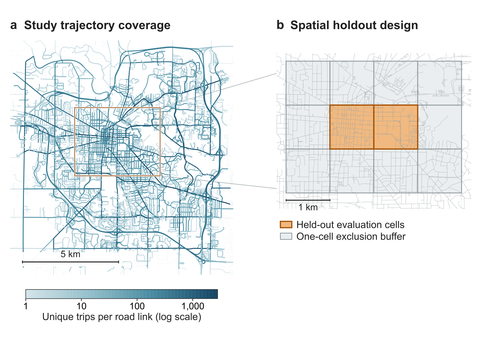

## Figure 2

Fig. 2. Data construction, paired prediction, and generalization design.

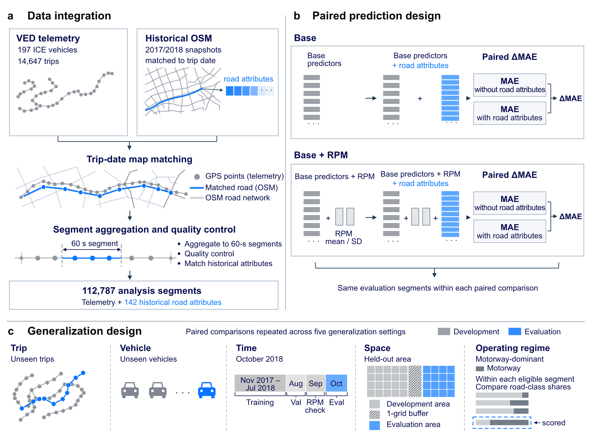

## Figure 3

Fig. 3. Road-attribute gains across evaluation settings and their reduction after adding RPM.

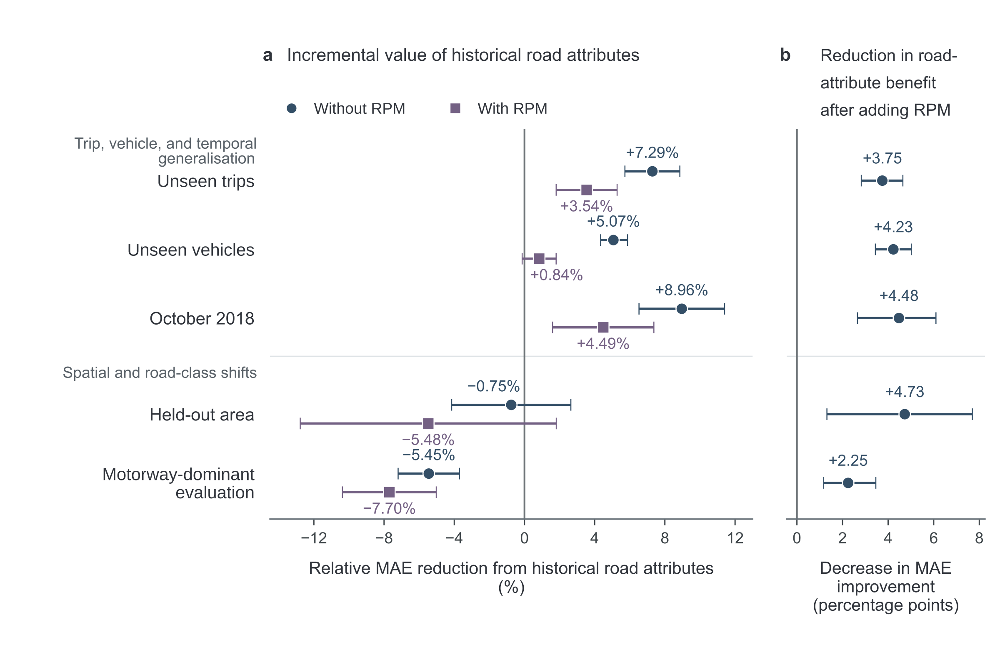

## Figure 4

Fig. 4. Road–trajectory pairing controls with compact telemetry. (a) Original gains with simultaneous 95% vehicle-cluster intervals and 20 matched-noise and 20 reassigned-road replicates. (b) Original-minus-control contrasts; points show replicate means and bars the full replicate ranges.

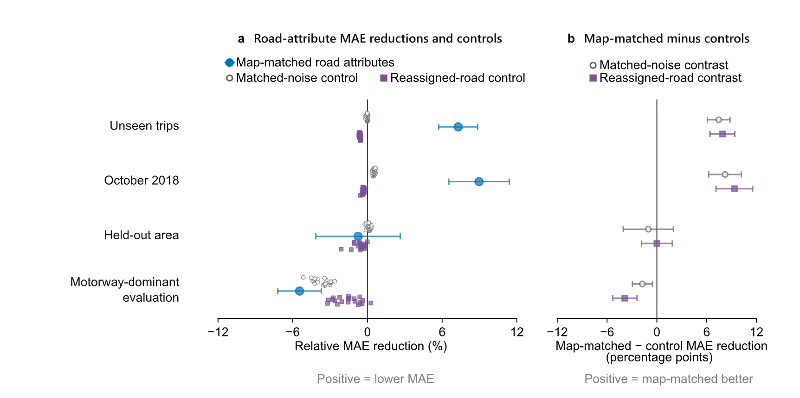

## Figure 5

Fig. 5. Predictive overlap of historical road attributes with kinematic summaries and RPM.

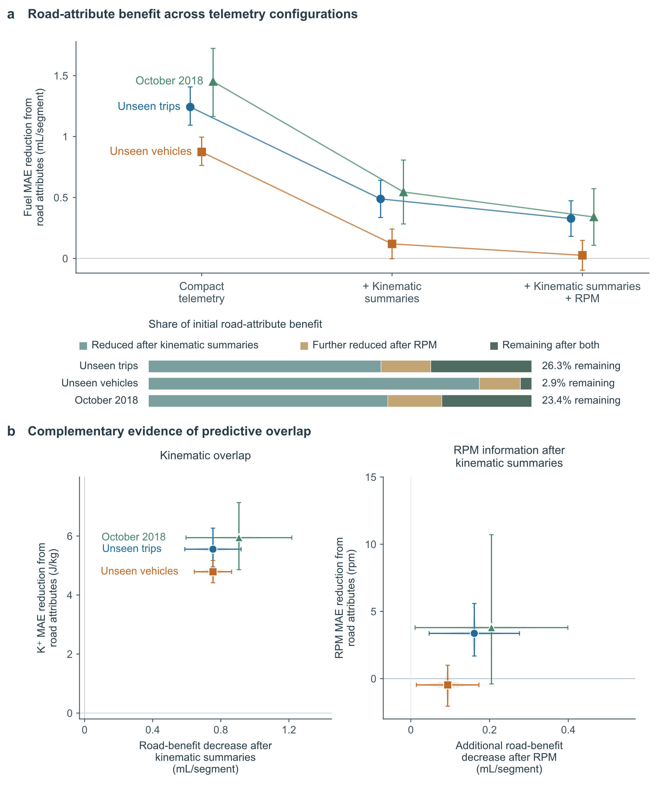

## Figure 6

Fig. 6. Cross-model sensitivity of road-attribute effects across evaluation settings.

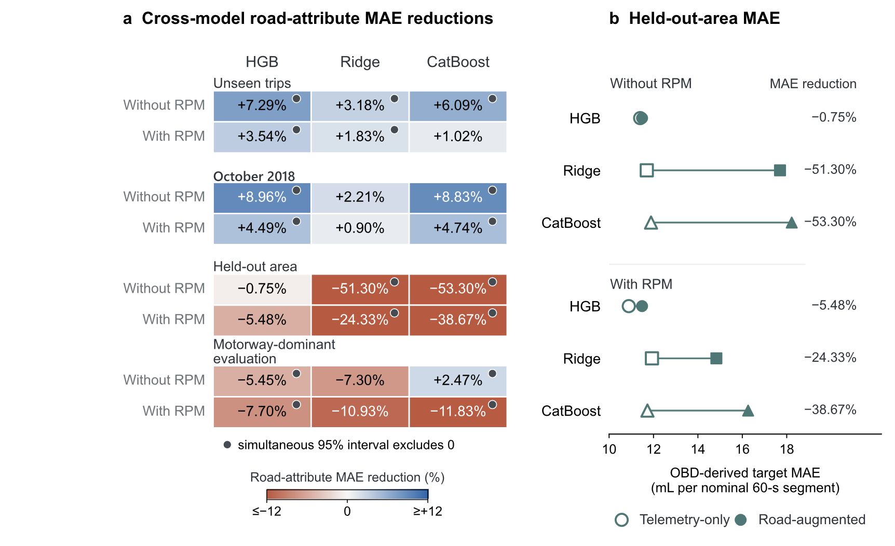

## Figure 7

Fig. 7. Road-distribution shift and road-attribute transfer to engine-speed prediction.

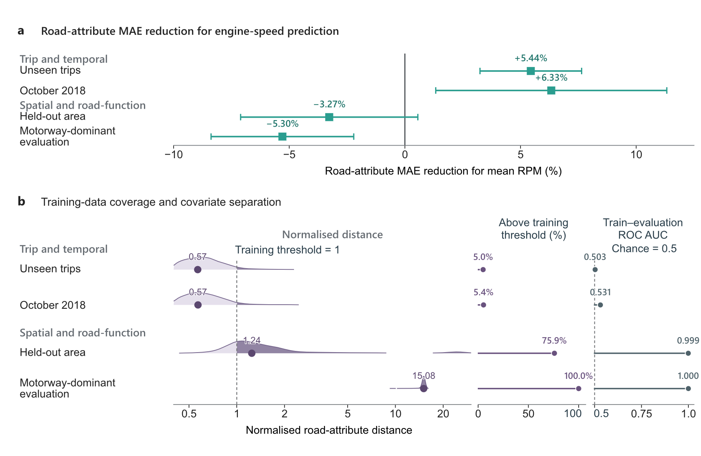

## Figure 8

Fig. 8. Held-out-area road-attribute gains and grid sensitivity. Displayed cells require ≥30 segments, ≥10 trips, and ≥5 vehicles; inference requires ≥15 vehicles; hatching indicates insufficient display support.

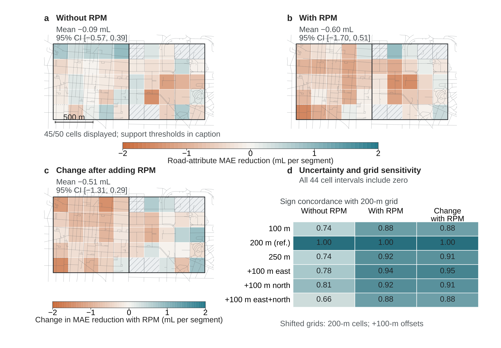

## Figure 9

Fig. 9. Fuel-volume dependence of road-attribute gains with compact telemetry. Observed-target deciles are defined separately within each evaluation setting, from Q1 (lowest) to Q10 (highest).

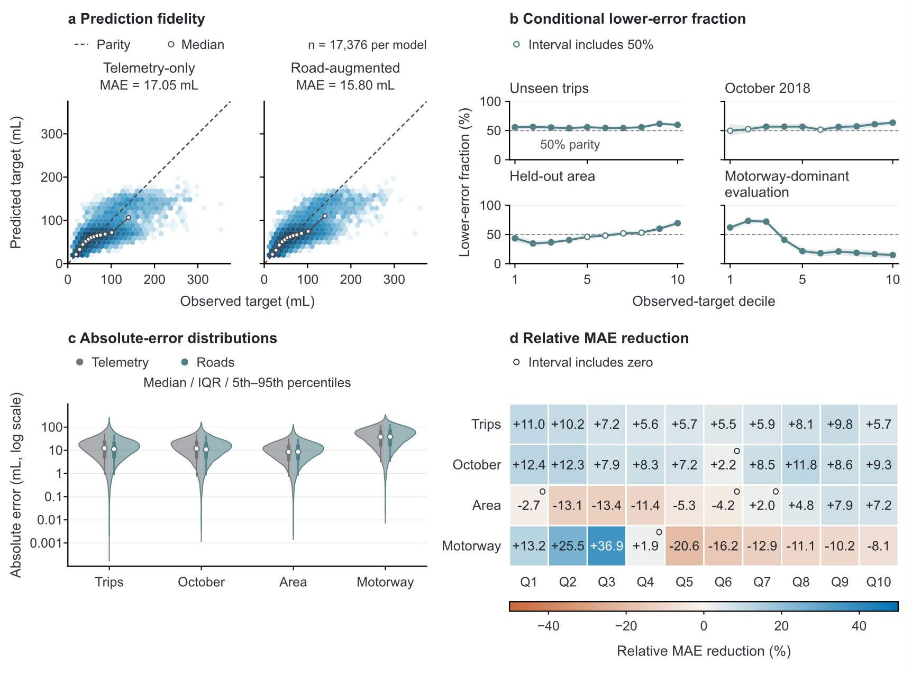

## Figure 10

Fig. 10. Speed-dependent road-attribute gains with compact telemetry.

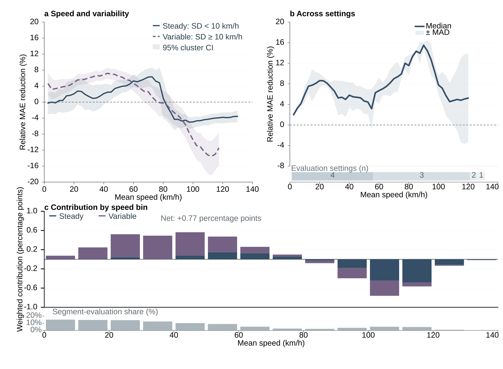

## Figure 11

Fig. 11. Road-attribute gain attenuation across fuel-accounting scales. The dashed transition in panel a restores complete-trip tails.

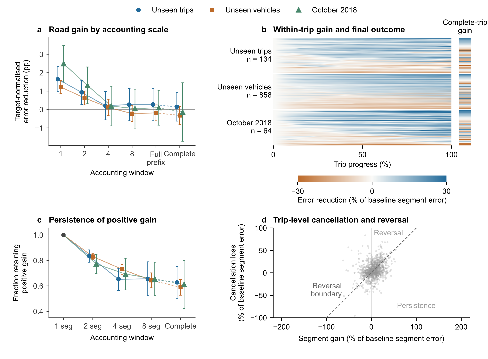

